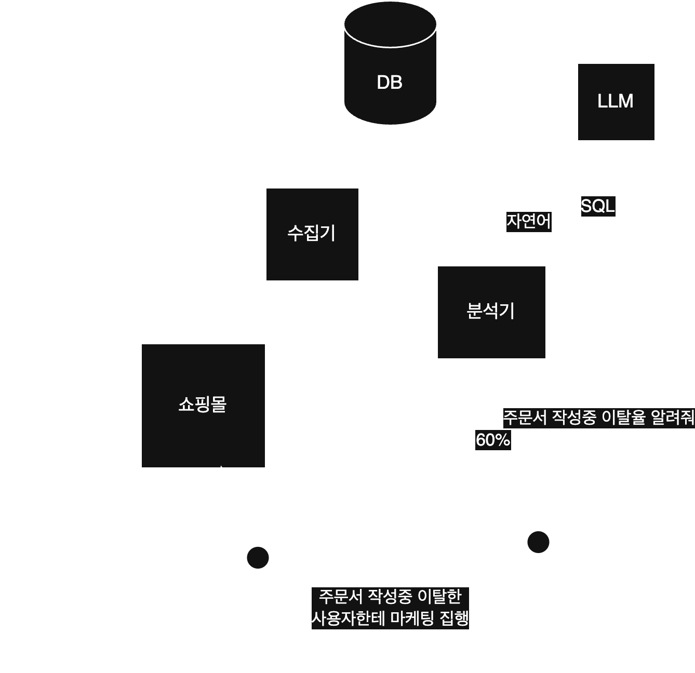

# UNTITLE

LLM이 마케터의 자연어 요청을 SQL로 변환하여 사용자 행동 데이터를 분석하는 프로그램입니다.  
기존 Firebase Analytics, GA4, GTM과 같은 마케팅 도구와 달리,  
개발자나 데이터 분석가의 도움 없이도 마케터가 직접 인사이트를 얻을 수 있도록 설계되었습니다.  

## 기존 마케팅 도구의 문제
| **문제점** | **해결방안** |
|------------|-------------|
| **데이터 분석이 어려움** <br> (SQL 작성 지식 필요, 개발자·분석가 의존) | **LLM 기반 자동 쿼리 생성** <br> 마케터의 자연어 요청을 SQL로 변환하여 즉시 분석 실행 가능 |
| **데이터 수집이 어려움** <br> (플랫폼 구조·이벤트 정의 복잡) | **Cafe24 등 정형화된 플랫폼 활용** <br> 표준화된 구조를 기반으로 빠르고 안정적인 이벤트 수집 가능 |
| **RAW 데이터 활용이 어려움** <br> (제한적 접근, 추출 비용 높음) | DB 직접 저장해서 추출 가능 |

## 아키텍쳐
<details>
<summary>
  프롬프트
</summary>

시스템 프롬프트
```
너는 데이터 분석가야.
사용자 행동 분석을 클라이언트 별로 대행하고 있어.
click-house merge-tree 엔진으로 설계되어 있어.

성능이 중요한 환경이야.
NOT IN 같은 쿼리는 성능이 나쁘니까 쓰지 말고,
가능하면 LEFT JOIN ... IS NULL 방식으로 바꿔줘.

중첩 서브쿼리 대신 WITH절을 사용해서 쿼리를 평탄하게 만들어줘.

아래 3가지중 하나의 쿼리를 작성해줘
어느 쿼리를 작성한건지 앞에적어줘

시작 종료 이벤트는 2개 합쳐서 2개인거야
조회한 횟수를 구할때는 event_type이 어쩌구start 인 레코드의 갯수만 세면 되는거야

A
요구사항에 맞는 event.uuid 를 select 하는 쿼리를 작성해.
event_type은 항상 명시해야해

B
요구사항에 맞는
비율을 조회하는 그룹쿼리를 줘

C
확실하지 않으면 다 모른다고 해
이벤트 타입에 명시된 행동이 아니면 C를 줘

테이블 구조는 다음과 같아, 날짜는 UTC 로 저장됨.
기간은 말 안하면 최근 7일전부터 오늘까지야

click-house toDateTime('2025-06-01 23:59:59', 9) 날짜는 이 함수 사용해

md 형식도 필요 없고, 줄바꿈 없이 쿼리를 작성해줘
```
유저 프롬프트
```
이 사용자의 client_id 는 {id} 이고, 오늘 날짜는 {2025-08-09} 타임존은 +9 날짜 조건은 로컬 자정 기준으로만 작성해
```
</details>


## 시연
엔진은 gemini-2.5-flash 을 사용하였습니다.

### 모수 조회
  

```sql
SELECT uuid -- 조건의 맞는 사용자 ID 조회
FROM event
WHERE client_id = 1 -- 어느 쇼핑몰인지
  AND event_type = 82 -- 어느 이벤트인지 (상품 조회 시작)
  AND product_id = '3' -- 어느 상품인지
  AND created_at >= toDateTime('2025-08-01 00:00:00', 9) -- 조회 시작 기간
  AND created_at <= toDateTime('2025-08-08 23:59:59', 9) -- 조회 종료 기간
GROUP BY uuid -- 같은 세션으로
HAVING count() >= 2 -- 이 행동을 2번이상 한지
```
gemini가 작성한 쿼리를 실행하니 조건의 맞는 회원의 UUID를 알 수 있었다.  

### 사용자 동향 조회


```sql
SELECT count(DISTINCT uuid) -- 중복된 이벤트 제거
FROM event
WHERE client_id = 1 -- 어느 쇼핑몰인지
  AND event_type = 31 -- 어느 이벤트인지 (메인 페이지 조회 시작)
  AND created_at >= toDateTime('2025-08-07 15:00:00', 'UTC') -- 조회 시작 기간
  AND created_at <= toDateTime('2025-08-08 14:59:59', 'UTC');-- 조회 종료 기간

SELECT count(DISTINCT uuid) -- 중복된 이벤트 제거
FROM event
WHERE client_id = 1 -- 어느 쇼핑몰인지
  AND created_at >= toDateTime('2025-08-08 00:00:00', 9) -- 조회 시작 기간
  AND created_at <= toDateTime('2025-08-08 23:59:59', 9);-- 조회 종료 기간
```

각각의 결과로 사용자중 90.9%가 메인 페이지를 조회했다는 것을 알 수 있다.

<details>
<summary>
  [개발자용] 테이블 구조
</summary>
  DB는 clickhouse의 MergeTree엔진 사용하였습니다.  
  
```sql
create table event
(
    event_id           UUID,
    client_id          Int32,
    uuid               UUID,
    event_type         UInt8,
    order_id           Nullable(String),
    tracking_id        Nullable(String),
    product_id         Nullable(String),
    product_option_id1 Nullable(String),
    product_option_id2 Nullable(String),
    product_quantity   Nullable(UInt8),
    price              Nullable(UInt32),
    amount             Nullable(UInt32),
    keyword            Nullable(String),
    sort_by            Nullable(String),
    page               Nullable(UInt8),
    board_id           Nullable(String),
    article_id         Nullable(String),
    login_id           Nullable(String),
    phone_number       Nullable(String),
    page_url           Nullable(String),
    category_id        Nullable(String),
    scroll_bucket      Nullable(UInt8),
    created_at         DateTime64(6)
)
    engine = MergeTree PARTITION BY toYYYYMMDD(created_at)
        ORDER BY (client_id, event_type, created_at, uuid)
        SETTINGS index_granularity = 8192;
```
</details>
<details>
<summary>
  [개발자용] 그렇다면 gemini가 작성한 쿼리의 성능은 어떨까?
</summary>

## 이벤트 수집기 성능 테스트

  
엔진에 맞는 쿼리를 작성였는지 각 항목별로 살펴보겠습니다.  
  
* clickhouse는 컬럼베이스로 저정됩니다.  

| **특성** | **작성방법** | **평가** |
|------------|-------------|-------------|
| clickhouse는 컬럼베이스로 저정됩니다. | 필요한 컬럼만 select에 명시하여야 합니다. | 🟢 |
| 카디널리티 넢은 순서대로 where에 명시하여야 한다 | 카디널리티는 예상치는 다음과 같다.<br> client = 2000, event_type = 60 product_id, created_at = 알 수 없음 | 🟢 |
| PREWHERE 키워드로 디스크 페이지 전체를 스킵할 수 있습니다 | ORDER BY 에 명시된 컬럼은 PREWHERE 로 조건을 작성하여야 합니다 | 🔴 |

### 총평
일반적인 쿼리는 잘 작성하지만 엔진이해도는 낮은 수준이다.  
프롬프트개선이나 파인튜닝으로 개선의 여지가 있다.

</details>


## 비용

### 성능 테스트

성능 테스트 도구는 [wrk](https://github.com/wg/wrk)를 사용했습니다.

#### 테스트 환경  
* 프로세서: m3 pro  
* core: 12 (6성능 / 6효율)  
* memoty: 36G  

비용 계산을 위해
6개 스레드를 사용하여 600개의 연결로 60초 동안
몇개의 요청을 처리했는지 확인합니다.

이 환경의 퍼포먼스는 aws ec2의 c8g.4xlarge와 비슷하며 가격은 550 USD/Month 이다.

```
wrk.method = "POST"
wrk.headers["Content-Type"] = "application/json"
wrk.body = '{"client_id": 1,"device_id": "d8b69cd5-0bfe-4be6-8f0f-a5060a1e9085"}'

wrk -t6 -c600 -d60s -s create_session.lua http://localhost:8080/api/v1/sessions
```

| **항목** | **값**                                |
|----------|--------------------------------------|
| 레이턴시 평균  | 13.79s                               |
| 레이턴시 안정성 | 90.79%                               |
| 처리 수     | 191,308 request/sec                  |
| DB 디스크 사용량  | 18.5 Byte/request |
| http 트래픽 | 1.78 GB/minute |

이 결과로 월 1000억건의 이벤트를 수신하고 12개월동안 보관했을때의 서버비를 알아보자.

#### 프로세스 비용
24시간 동안 균일한 데이터 수신한다는 가정으로 c8g.4xlarge가 0.21대 필요하다.   
550 * 0.21 = 115 USD/Month   

#### 스토리지 비용
18.5 Byte * 1.0e11 * 12 개월 = 22.2T
s3의 스토리지 비용은 0.025 GB/Month  
22,200 * 0.025 = 555 USD/Month  

총합 670 USD/Month 가 필요하다.

### 커버리지

그렇다면 1000억건의 이벤트는 어느정도의 양일까?  

sdk를 설치한후 10분동안 쇼핑을 해보았다.  
10분동안 1,100개의 이벤트를 생성했다.  
60분마다 1개의 주문서 작성한다고 가정하였을떄.  

2025-07의 cafe24 전체 고객사의 이벤트는 약 320만건이다.  
이때 210억개의 이벤트가 발생한다.

670USD/Month 로 안정적인 운영이 가능하다.

## 활용 방안

## 메시징 서비스 고도화

### 고객 세그먼트
이렇게 수집된 UUID로 cafe24 api와 통신하여 마케팅 동의 여부와 전화번호를 얻을 수 있습니다.
이 전화번호로 메시지 발송 가능합니다.

### 카카오 원가 절감
안드로이드 2015년도 부터 지원했으며   
IOS도 최근에 [웹푸시](https://documentation.onesignal.com/docs/web-push-for-ios)를 지원하기 시작했습니다.   

SDK를 확장하여 firebase cloud message를 사용하여   
알림톡 발송량을 일부를 웹푸시로 발송하여 알림톡 원가를 절감한다.

## A/B 테스트

## 거시적 시장 분석

## 데이터 판매
